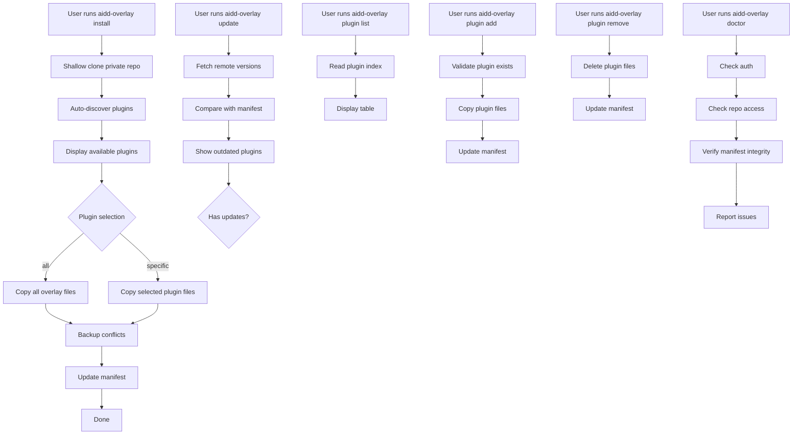

# Instruction: aidd-cli Overlay System

## Feature

- **Summary**: Private git repo CLI that extends AIDD framework with installable overlays (plugins) on top of aidd-cli
- **Stack**: `[Node.js 20+, TypeScript, Commander.js, @inquirer/prompts, simple-git]`
- **Branch name**: `feat/aidd-overlay-cli`
- **Parent Plan**: none
- **Sequence**: standalone
- Confidence: 9/10
- Time to implement: ~1 week

## Existing files

- `@home/tnn/.npm-global/lib/node_modules/@ai-driven-dev/cli/` (reference only)

### New file to create

- Complete new npm package: `@your-org/aidd-overlay-cli`

## Architecture Decisions

| Decision | Choice | Rationale |
|----------|--------|-----------|
| Auth config | `~/.config/aidd-overlay/` | Separate from aidd-cli (`~/.config/aidd/`) |
| Repo access | Shallow git clone | Supports large files, binary assets, full git history if needed |
| Repo branch | Configurable via `--branch` or `config.json` | Default: `main`, fallback: `master` |
| Project manifest | `.aidd-overlay/manifest.json` | Per-project tracking |
| Plugin cache | `~/.cache/aidd-overlay/` | Avoid repeated API calls |
| Conflict resolution | Backup then overwrite | No data loss, user can restore |
| Git credentials | Git credential helper + `GIT_ASKPASS` | Same mechanism as git CLI |

## User Journey



## Plugin Structure (in private repo)

```
private-repo/
├── plugins/
│   ├── my-plugin-1/
│   │   ├── version.txt          # "1.0.0"
│   │   ├── .opencode/
│   │   │   ├── rules/
│   │   │   ├── commands/
│   │   │   └── agents/
│   │   └── docs/                # optional
│   ├── my-plugin-2/
│   │   ├── version.txt
│   │   └── ...
│   └── index.json               # { plugins: [{ id, name, description, version }] }
└── README.md
```

## Local Project Structure

```
project/
├── .aidd-overlay/
│   ├── manifest.json            # { installedPlugins: [{ id, version, files: [...] }] }
│   └── backups/                 # Conflict backups (auto-cleanup after 30 days)
└── .opencode/                   # Plugin files installed here
    └── ... (plugin content)
```

## Commands

| Command | Description |
|---------|-------------|
| `aidd-overlay install [--all\|--plugin <name>...]` | Install plugins |
| `aidd-overlay update [--dry-run] [--plugin <name>]` | Check and apply updates |
| `aidd-overlay plugin list` | List available plugins |
| `aidd-overlay plugin add <name>` | Install specific plugin |
| `aidd-overlay plugin remove <name> [--force]` | Remove plugin |
| `aidd-overlay restore <plugin>` | Restore plugin from backup |
| `aidd-overlay clean` | Remove all overlay files + manifest |
| `aidd-overlay doctor` | Verify installation health |
| `aidd-overlay auth login [--token\|--gh]` | Authenticate |
| `aidd-overlay auth status` | Show auth status |

## Implementation phases

### Phase 1: Project Setup

> Initialize npm package with TypeScript and CLI dependencies

1. Create package structure with TypeScript
2. Add dependencies: commander, @inquirer/prompts, simple-git, fs-extra
3. Create own auth system (do NOT share with aidd-cli)
4. Configure build with tsup

### Phase 2: Core Infrastructure

> Build authentication, git operations, and file system utilities

1. Implement AuthStorage in `~/.config/aidd-overlay/auth.json`
2. Implement AuthReader with same pattern as aidd-cli
3. Create GitRepository service (clone, pull, getContents)
4. Implement FileService (copy, backup, delete, hash)
5. Create BackupManager (save to `.aidd-overlay/backups/`)
6. Implement BackupCleanup (delete backups older than 30 days)

### Phase 3: Plugin Discovery Engine

> Auto-discover plugins from private repo

1. Create PluginRepository (fetch from remote repo)
2. Implement PluginIndex (parse index.json or scan directories)
3. Implement PluginCache (store in `~/.cache/aidd-overlay/`)
4. Create PluginVersionManager (read version.txt)

### Phase 4: Manifest System

> Track installed plugins and files

1. Define Manifest schema (installedPlugins, files, hashes)
2. Implement ManifestService (read, write, update)
3. Implement ConflictDetector (compare disk vs manifest)
4. Create BackupRestorer (restore from backups)

### Phase 5: Install Command

> Copy overlay files to project

1. Shallow clone private repo (depth=1, branch from config)
2. Show progress: "Cloning repository..."
3. Auto-discover available plugins
4. Display interactive plugin selection (or --all flag)
5. Show progress: "Installing plugin X..."
6. Copy selected plugin files to `.opencode/`
7. Detect conflicts, create backups before overwrite
8. Update manifest

### Phase 6: Update Command

> Compare and apply version updates

1. Fetch remote plugin versions (git pull or API)
2. Compare with local manifest
3. Display diff table (plugin, local version, remote version)
4. `--dry-run` flag: show what would change without applying
5. Apply updates for selected/all outdated plugins
6. Update manifest

### Phase 7: Plugin Commands

> Manage individual plugins

1. `plugin list`: Read index, display formatted table
2. `plugin add <name>`: Validate exists, copy files, update manifest
3. `plugin remove <name>`: Delete files, update manifest, cleanup backups

### Phase 8: Utility Commands

> Health checks, cleanup, and restore

1. `doctor`: Check auth, repo access, manifest integrity
2. `auth login`: GitHub PAT or gh CLI token
3. `auth status`: Show current auth state
4. `restore <plugin>`: List backups for plugin, restore selected
5. `clean`: Remove all `.aidd-overlay/` files, confirm before action

### Phase 9: CLI Integration

> Finalize command registration and publishing

1. Register all commands with Commander
2. Add global options (--repo, --verbose)
3. Create bin entry point (`aidd-overlay`)
4. Publish to npm (private registry or GitHub Packages)

## Validation flow

1. Create test private repo with 2 plugins
2. Run `aidd-overlay auth login --token <token>` — verify auth works
3. Run `aidd-overlay install --plugin plugin-1` — verify single plugin install
4. Run `aidd-overlay plugin list` — verify listing works
5. Run `aidd-overlay update --dry-run` — verify diff display
6. Run `aidd-overlay update --plugin plugin-1` — verify update applies
7. Run `aidd-overlay plugin remove plugin-1` — verify cleanup
8. Run `aidd-overlay doctor` — verify health check passes
9. Verify backups created on conflicts
10. Verify `.aidd-overlay/manifest.json` accurate
11. Run `aidd-overlay restore plugin-1` — verify restore works
12. Run `aidd-overlay clean` — verify all files removed
